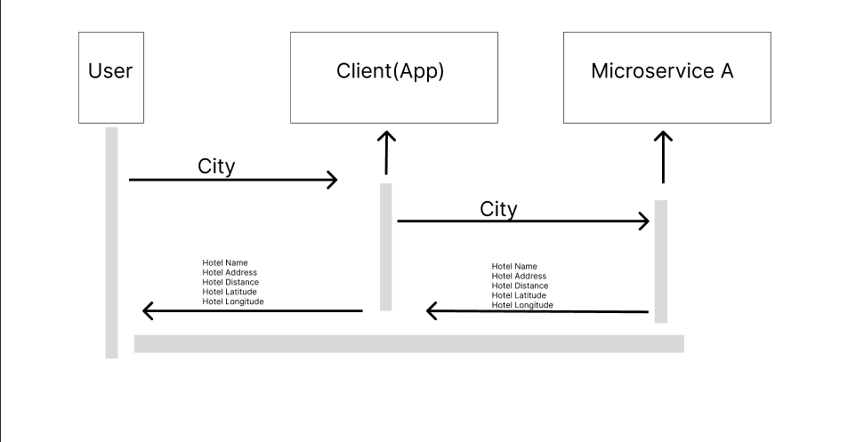

# Communication Contract

# Requesting Data from Hotel Microservice
- To request information locally, the client can request information via a HTTP POST. The POST that will recieve the information is (http://localhost:3005/hotels). 
- To retireve information for a given area, the user can make a request via a string input. Such that the microservice can process and retrieve hotel information within that given area. 
- Example of Data Request: 

     
            const city = await user_prompt("Enter in a city: ");
            const response = await axios.post("http://localhost:3005/hotels", {
                /*passing in the user input as a string*/
                city
            });

# Client Receiving Data from Hotel Microservice
- The microservice will receieve the name of hotel and return name of the hotel, address, distance, and latitude/longitude postion. 
- Retrieving data from microservice:

            /*the user input a city, now we want to retrieve data and print*/
              const city = await user_prompt("Enter in a city: ");

              /*retrived information based on area */
              const response = await axios.post("http://localhost:3005/hotels", {
                    city
                });

                /*print it back to user provided the name,address, distance etc*/
               console.log("Hotels in the area: ", response.data)

# UML Sequence Diagram

# Mitigation Plan
- For which teammate did you implement “Microservice A”?  -Suhrob Hasanov 
- What is the current status of the microservice? Hopefully, it’s done! -Its done 
- How is your teammate going to access your microservice? They can access it with this github link https://github.com/Francisco-Cervantes/Microservice_A-CS361-, and the program or microservice can be accessed remotely with a url. 
- If your teammate cannot access/call YOUR microservice, what should they do? Can you be available to help them? What’s your availability? They can contact me through discord to discuss any issues that may arise.
- If your teammate cannot access/call your microservice, by when do they need to tell you provide a specific date to ensure they have a clear deadline. They can contact be before May 25 to work anything out. 
- Is there anything else your teammate needs to know? They should install the node dependencies before attempting to run the program.
